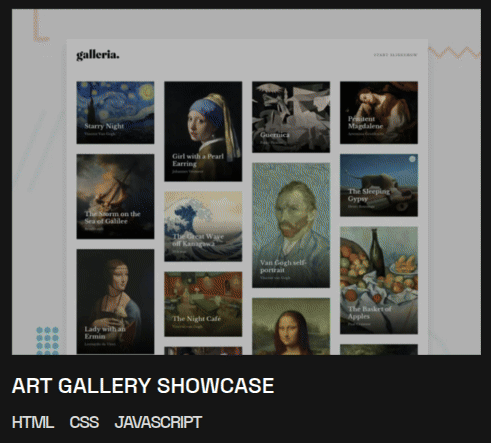

# Portfolio

🔗 [Live Demo](https://irenemendoza.github.io/portfolio-project/)

A responsive personal portfolio built following a Figma design, with a mobile-first approach and modern interactive effects.

## 📸 Preview


### Interactive Demo



## ✨ Features

- **Mobile-first responsive design** with three breakpoints:
  - Mobile: < 768px
  - Tablet: 768px - 1200px
  - Desktop: ≥ 1200px
- **Semantic HTML** for better accessibility and SEO
- **Interactive effects** on buttons and links (hover states, transitions)
- **Optimized SVG icons**
- Organized CSS architecture with SCSS
- Pixel-perfect implementation from Figma mockup

## 🛠️ Tech Stack

- **HTML5** - Semantic structure
- **SCSS/Sass** - CSS preprocessor
- **Vite** - Build tool and dev server
- **SVG** - Scalable icons

## 🚀 Getting Started

### Prerequisites

- Node.js (v14 or higher)
- npm or yarn

### Installation
```bash
# Clone the repository
git clone https://github.com/irenemendoza/portfolio-project.git

# Navigate to directory
cd portfolio-project

# Install dependencies
npm install

# Start development server
npm run dev
```

The project will be available at `http://localhost:5173`

## 📦 Available Scripts
```bash
npm run dev      # Development server
npm run build    # Production build
npm run preview  # Preview build
npm run deploy   # Deploy to GitHub Pages
```

## 🚢 Deployment

The project automatically deploys to GitHub Pages:
```bash
npm run deploy
```

This generates the build and publishes it to the `gh-pages` branch.

## 📋 Project Structure
```
portfolio-project/
├── src/
│   ├── styles/
│   │   ├── _variables.scss
│   │   ├── _mixins.scss
│   │   └── main.scss
│   ├── assets/
│   │   └── icons/
│   └── index.html
├── docs/              # Screenshots (optional)
├── package.json
└── vite.config.js
```

## 🎯 Development Focus

- Pixel-perfect Figma design implementation
- **Mobile-first approach** for better performance
- Relative units usage (rem, em, %)
- CSS hover states and transitions
- Reusable SCSS components
- Asset optimization (SVG)

## 📱 Responsive Design

The design adapts fluidly to different devices:
- Hamburger menu on mobile
- Adaptive grid for portfolio items
- Scalable typography
- Optimized images per breakpoint

## 🤝 Contributing

This is a personal portfolio project, but suggestions and feedback are welcome.

## 👩‍💻 Author

**Irene Mendoza**
- GitHub: [@irenemendoza](https://github.com/irenemendoza)
- Portfolio: [irenemendoza.github.io](https://irenemendoza.github.io/portfolio-project/)

---

⭐ If you liked this project, give it a star!